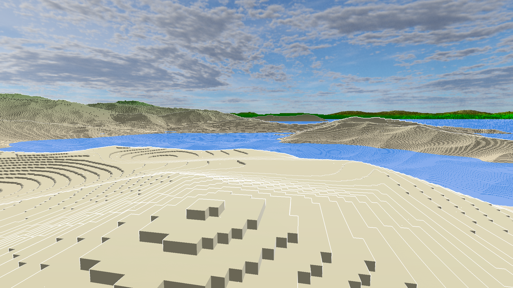

# Mitchell's Page

## About Me
- I am a *3rd* year **Computer Science** major
+ ~~I can program in javascript~~
* **I like the _C_ programming language**
+ I like ***Computer Graphics***

### Here is a project I made *Winter Quarter 2024* that I think is cool: [Voxel "Engine" - github link](https://github.com/lazergenixdev/First-Voxel-Engine/tree/lod)
1. The code is absolutly terribly structured
2. Sending chunk data to GPU **desperately needs** caching
3. But the render distance is cool, with render area of (2 million)<sup>2</sup> blocks



I am also interested in compilers, here is a snippet of code from a parser I wrote:
```cpp
kai_result kai_create_syntax_tree(kai_Syntax_Tree_Create_Info* info, kai_AST* out_AST)
{
    Parser_Context ctx{
        info->memory,
        Lexer_Context{info->source},
    };
    ctx.stack      = ctx.memory.temperary;
    ctx.stack_size = ctx.memory.temperary_size;

    // setup first token
    auto& cur = ctx.lexer.next_token();

    // use temperary memory to store the statements we parse.
    auto statements = reinterpret_cast<kai_Stmt*>(ctx.stack);
    kai_u32 count = 0;

    while (cur.type != token_end)
    {
        ctx.stack = statements + count;
        auto stmt = Parse_Statement(ctx, true);

        if (!stmt) { ctx.error_expected("a top level statement [from top]"); goto error; }

        __check_temp_stack_overflow(statements + count, ctx);
        statements[count++] = stmt;

        ctx.lexer.next_token(); // get first token of next statement
    }

    // allocate the space we need for how many statements we have:
    out_AST->toplevel_stmts = (kai_Stmt*)ctx.memory.alloc(ctx.memory.user, count * sizeof(kai_Stmt));
    out_AST->toplevel_count = count;

    // copy expressions from temperary storage:
    memcpy(out_AST->toplevel_stmts, statements, count * sizeof(kai_Stmt));

error:
    if (ctx.error_info.result) {
        if (info->error) {
            *info->error = ctx.error_info;
            info->error->location.file   = out_AST->source_filename;
            info->error->location.source = info->source.data;
        }
        return ctx.error_info.result;
    }

    return kai_Result_Success;
}
```
